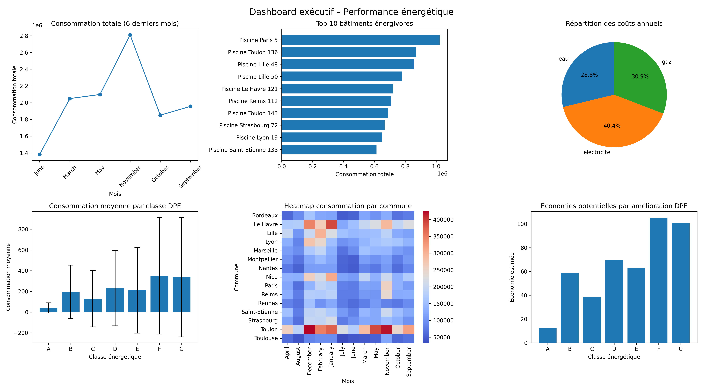
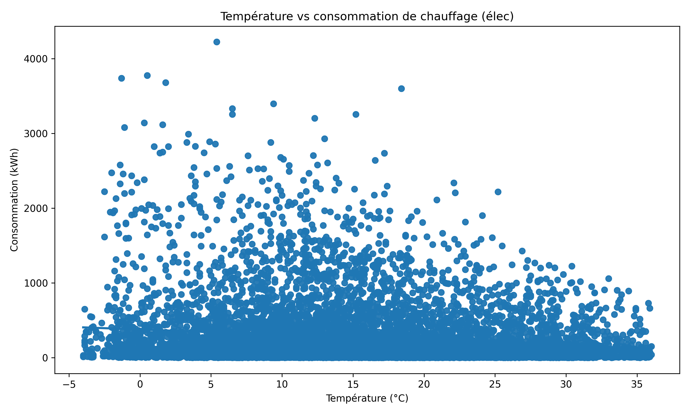
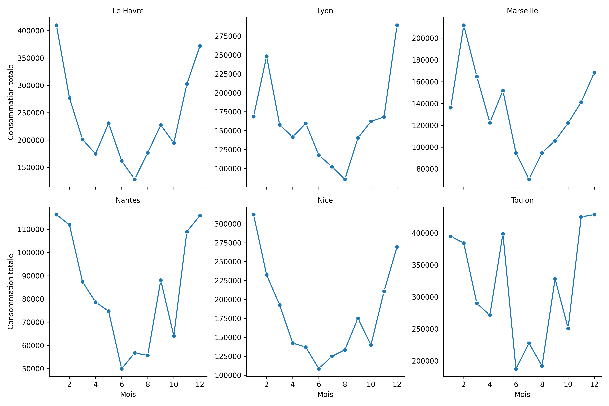

# Rapport de synthèse – Analyse consommation énergétique des bâtiments publics
## 1. Résumé executif

Ce projet vise à analyser et optimiser la consommation énergétique des bâtiments publics de différentes régions. Les données collectées (électricité, gaz, eau) ont été nettoyées, enrichies avec les caractéristiques des bâtiments et les données météorologiques. Des indicateurs clés ont été calculés, les anomalies détectées, et des visualisations synthétiques produites. L’analyse permet de cibler les bâtiments les plus énergivores et de proposer des actions correctives et de rénovation pour réduire les coûts et l’impact environnemental.

## 2. Métriques clés

Grâce aux différentes analyses effectué, nous observons que : 

• Les batiments avec les plus hautes consommations sont les piscines.

• Il y a davantage de consommation en periode hivernal

• La consommation électrique est la plus importante contre l'eau et le gaz

• Il est possible d'effectuer d'importantes économies si des travaux sont réalisés pour les classe F et G

## 3. Insights principaux

Les piscines et certains gymnases dépassent largement la consommation moyenne de leur catégorie et devraient être audités en priorité.

### Impact de la météo :
La consommation de chauffage est  corrélée à la température 

### Consommation par communes : 
Certaines communes ont des consommations globales plus élevées 

### 4. Recommandations concrètes

• Optimiser l’usage énergétique : chauffage, éclairage et ventilation selon occupation réelle.

• Sensibiliser le personnel à la consommation énergétique.

• Planifier des rénovations énergétiques pour les bâtiments hors norme et ceux en classes F et G.

Bâtiments à auditer en priorité :

• Piscines et Gymnases

